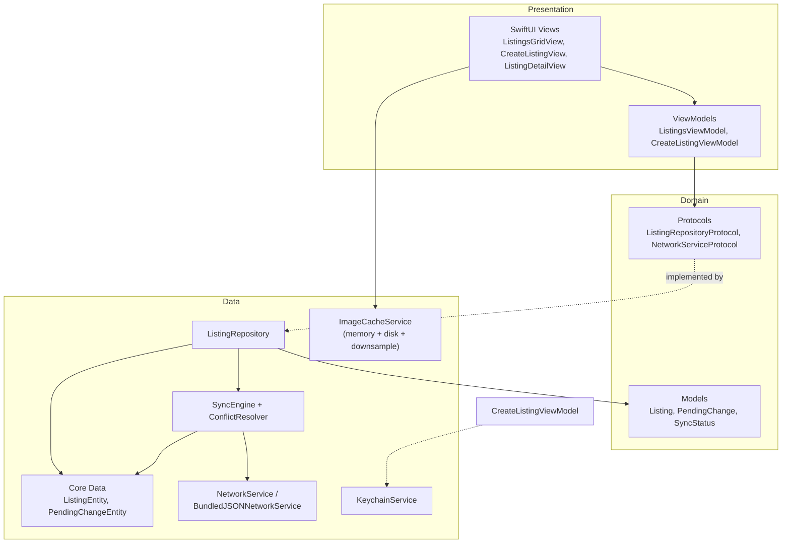
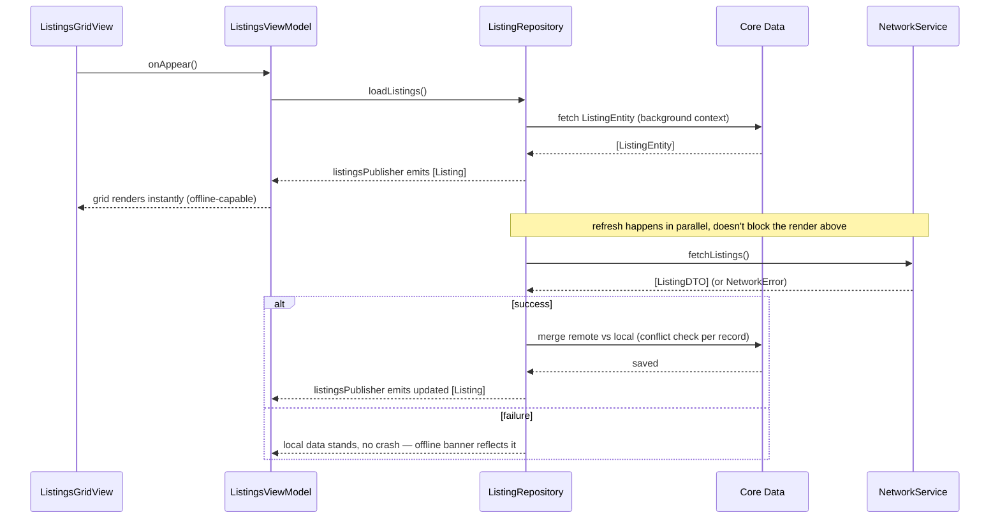
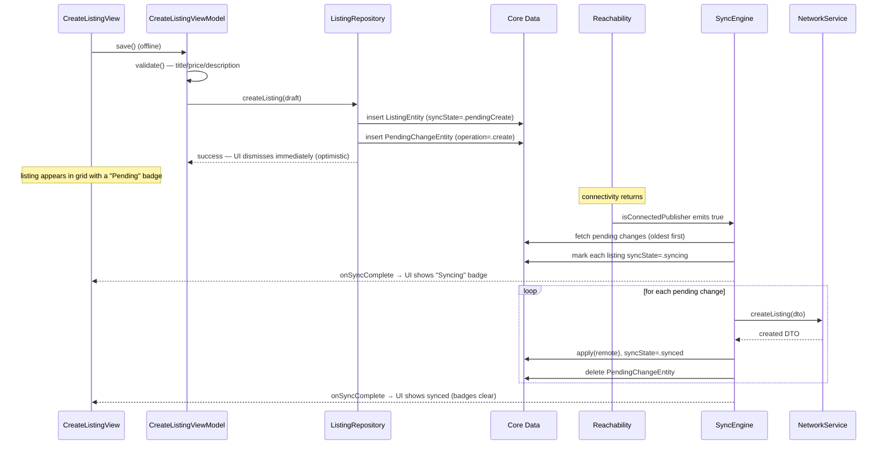
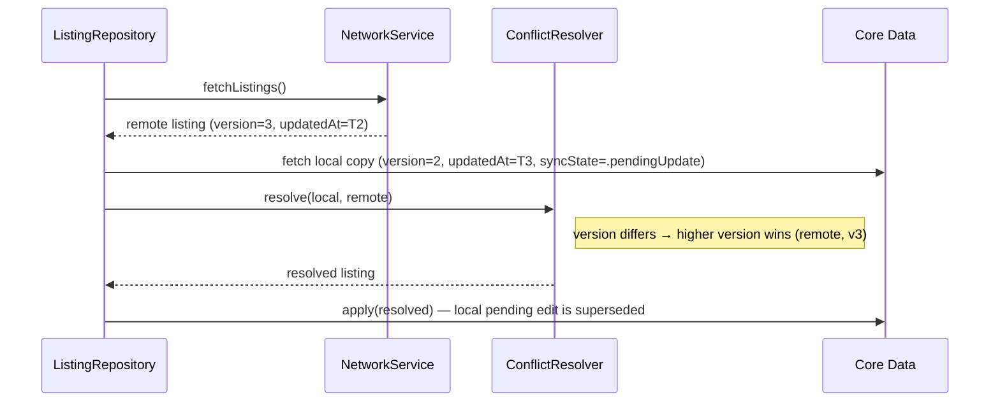

# Architecture

PocketMarket is an offline-first iOS marketplace app: browse a catalog,
favorite items, create new listings while offline, and have them sync
automatically once connectivity returns.

Diagrams are in Mermaid — render on GitHub natively, or paste into
https://mermaid.live for a picture to drop into the demo video/slides.

## Layered architecture

**Why this shape:** the ViewModel only ever imports `Domain` types and
protocols — it has never heard of Core Data or `URLSession`. That boundary
is what makes `ListingsViewModel` testable against a fake repository with
zero persistence or network setup, and what lets `NetworkService` swap in
for `BundledJSONNetworkService` (or a real backend later) without touching
any of the Repository's callers.

## Sequence: cold launch → local render → background refresh

## Sequence: create a listing while offline, then sync on reconnect

## Sequence: conflict during background refresh

---

## File-by-file reference

### App (`App/`)
| File | Role |
|---|---|
| `PocketMarketApp.swift` | `@main` entry point. Builds `ListingsGridView` with a ViewModel from `AppContainer`. |
| `AppContainer.swift` | Composition root — constructs every dependency (Core Data stack, network service, sync engine, repository, image cache, keychain) as a protocol type and wires them together. The only place a concrete type is ever instantiated directly. |

### Domain (`Domain/`) — pure Swift, no framework imports
| File | Role |
|---|---|
| `Models/Listing.swift` | Core domain struct — `id`, `title`, `price`, `syncState`, `version`, etc. Also defines `SyncState` (`.synced`, `.pendingCreate`, `.pendingUpdate`, `.syncing`, `.failed`). |
| `Models/PendingChange.swift` | One queued offline mutation — operation type, payload, retry count. |
| `Protocols/ListingRepositoryProtocol.swift` | The boundary the ViewModel layer talks to. Defines `SyncStatus` and `NewListingDraft` too. |
| `Protocols/NetworkServiceProtocol.swift` | The boundary the Repository talks to for remote data. Defines `NetworkError`. |

### Data (`Data/`)
| File | Role |
|---|---|
| `Network/BundledJSONNetworkService.swift` | Mock "remote API" — reads `listings_200.json` from the bundle, simulates latency. |
| `Network/NetworkService.swift` | Real `URLSession`-based client, same protocol, ready to point at a hosted API. |
| `Persistence/PersistenceController.swift` | Core Data stack — one `NSPersistentContainer`, one serial `backgroundContext` for all writes (deterministic ordering). |
| `Persistence/EntityMapping.swift` | `ListingEntity ↔ Listing` and `PendingChangeEntity ↔ PendingChange` conversions. |
| `Repository/ListingRepository.swift` | Single source of truth. Reads always come from Core Data; writes go to Core Data immediately (optimistic) and are queued for `SyncEngine`. |
| `Sync/SyncEngine.swift` | Drains the pending-change queue oldest-first. Triggers: reachability change, app foreground, periodic reachability probe. Transitions listings `.pendingCreate → .syncing → .synced` so the UI shows every intermediate state. |
| `Sync/ConflictResolver.swift` | Last-write-wins: compares `version` first, falls back to `updatedAt`. |
| `Cache/ImageCacheService.swift` | Actor-based two-tier cache (`NSCache` + disk), decode-time downsampling via `ImageIO`. |
| `Security/KeychainService.swift` | Keychain wrapper for secure token storage (ready for when the mock API becomes a real authenticated one). |
| `DTOs/ListingDTO.swift` | Wire format + `toDomain()`/`toDTO()` mapping. |

### Presentation (`Presentation/`)
| File | Role |
|---|---|
| `Listings/ListingsGridView.swift` | Main screen — `LazyVGrid`, pull-to-refresh, category filter, sync banner. |
| `Listings/ListingsViewModel.swift` | Subscribes to repository publishers, owns filter state. |
| `Listings/ListingCard.swift` | Single grid cell. |
| `CreateListing/CreateListingView.swift` | Form for posting a new listing. |
| `CreateListing/CreateListingViewModel.swift` | Validation + save flow. |
| `CreateListing/CameraCaptureView.swift` | `UIImagePickerController` camera wrapper. |
| `CreateListing/PhotoLibraryPickerView.swift` | `PHPickerViewController` library wrapper (no Photos permission needed). |
| `Detail/ListingDetailView.swift` | Full listing detail screen. |
| `Components/CachedAsyncImageView.swift` | Async image view backed by `ImageCacheService`, supports `localImagePath` for offline-created listings. |
| `Components/SyncStatusBadge.swift` | Per-card badge + top banner reflecting sync state. |

### Utilities (`Utilities/`)
| File | Role |
|---|---|
| `Reachability.swift` | `NWPathMonitor` wrapper exposed as a `CurrentValueSubject<Bool, Never>` (not `@Published`, to avoid the `willSet` timing pitfall where a subscriber can read the old value). Includes a one-shot `recheckConnectivity()` probe for catching reconnects the long-lived monitor misses (a known iOS Simulator behavior). |
